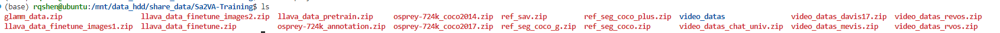

# 环境准备
```shell
基本要求
- Python 3.10
- PyTorch 2.6.0
- CUDA 12.4

推荐使用conda创建独立环境, 名为spatial
conda create -n spatial python=3.10 -y 
conda activate spatial
pip install -r requirements.txt
```

# 数据准备

下载命令如下

```shell
sudo apt-get install git-lfs
git lfs install
git clone https://huggingface.co/datasets/Dense-World/Sa2VA-Training

# 应该会自动开始下载大文件, 如果没有, 手动执行
git lfs pull

# 下载后的存储路径可更改, 本例为: /home/volume_shared/share_datasets
```

下载完成的界面将如下图所示：


只需要解压其中的
```shell
ref_seg_coco.zip, 
ref_seg_coco_g.zip，
ref_seg_coco_+.zip，
video_datas_mevis.zip，
video_datas_rvos.zip 
其余Image Video QA数据集暂时不用
```

注意，由于ReVOS在上述链接中不完整，因此只能手动下载
[ReVOS](https://mailsjlueducn-my.sharepoint.com/personal/yancl9918_mails_jlu_edu_cn/_layouts/15/onedrive.aspx?id=%2Fpersonal%2Fyancl9918%5Fmails%5Fjlu%5Fedu%5Fcn%2FDocuments%2Fdataset%2Frevos%5Feccv%5Fdataset%2FReVOS&ga=1)，
并与上述文件放置在同一位置


请在配置文件 projects/llava_sam2/configs/sa2va_8b_spatial.py 中同步修改， 示例如下

```shell
################### refer image seg ####################
# RefCOCO, RefCOCOg, RefCOCO+

# 已经通过dataset处理, 将mask转为box

################### refer video seg ####################

# 请注意，对于Ref/Reason-VOS数据集，我们不使用它们的mask，而是使用转换后的box
# 它们的box.json统一保存在mask_to_box下, 它是home目录的一个subfolder

# ReVOS 
data_root_revos = '/home/volume_shared/share_datasets/ReVOS/'
video_revos_image_folder = data_root_revos + 'JPEGImages'
video_revos_expression_file = data_root_revos + 'meta_expressions_train_.json'
video_revos_box_file = 'mask_to_box/revos_bbox.json'  # home目录下

# MeViS
data_root_mevis = '/home/volume_shared/share_datasets/MeViS/MeViS_release/train/'
video_mevis_image_folder = data_root_mevis + 'JPEGImages'
video_mevis_expression_file = data_root_mevis + 'meta_expressions.json'
video_mevis_box_file = 'mask_to_box/mevis_bbox.json'  

# Ref-YoutubeVOS
data_root_refytvos = '/home/volume_shared/share_datasets/Ref-Youtube-VOS/'
video_refytvos_image_folder = data_root_refytvos + 'train/JPEGImages/'
video_refytvos_expression_file = 'ref_ytvos_expressions.json'
video_refytvos_box_file = 'mask_to_box/ref_ytvos_bbox.json'
# 注意, ref_ytvos的expression需要用改动后的(ref_ytvos_expressions.json), 因为原始的没有anno_id
```

下面介绍我们的空间位置关系数据集，数据来源是各类VOS数据集，包括MOSE, DAVIS17, YTVOS19, LVOS(v1&v2)，以及SA-V的sav_001到sav_010

由于目前是第二批，所以我命名为all_vos2，其中JPEGImages部分，我打包上传到了百度网盘

您也可以手动下载每个数据集，将它们的JPEGImages拼接在一起即可
[MOSE](https://entuedu-my.sharepoint.com/personal/liuc0058_e_ntu_edu_sg/_layouts/15/onedrive.aspx?id=%2Fpersonal%2Fliuc0058%5Fe%5Fntu%5Fedu%5Fsg%2FDocuments%2Fopensource%2FMOSE%5Frelease&ga=1)
[DAVIS17](https://davischallenge.org/davis2017/code.html)
[YTVOS19](https://drive.google.com/drive/folders/1XwjQ-eysmOb7JdmJAwfVOBZX-aMbHccC)
[LVOS](https://drive.google.com/file/d/1-ehpl5s0Fd14WwtT-GmWtIWa_BxZl9D6/view)
[SA-V](https://ai.meta.com/datasets/segment-anything-video/)

```shell
################### spatial relation dataset ####################
# 下面这部分是我们的空间位置关系数据集

# relative relation  相对位置关系 （左右）
video_relative_image_folder = '/tmp/all_vos2/'  # JPEGImages
video_relative_expression_file = 'all_vos2_relative_step2.json' # meta_expressions
video_relative_box_file = 'mask_to_box/all_vos2_relative_box.json'  # box

# absolute relation  绝对位置关系 （左右）
video_absolute_image_folder = '/tmp/all_vos2/'
video_absolute_expression_file = 'all_vos2_absolute_step2.json'
video_absolute_box_file = 'mask_to_box/all_vos2_absolute_box.json'
```


#  训练
```shell
# 执行命令, 8卡训练

CUDA_VISIBLE_DEVICES=0,1,2,3,4,5,6,7 bash tools/dist.sh train projects/llava_sam2/configs/sa2va_8b_spatial.py 8 --work-dir spatial_mllm_save

# checkpoint存储路径在spatial_mllm_save
```